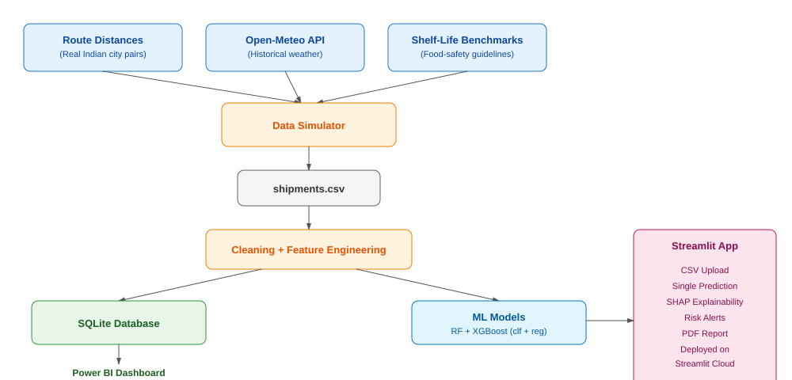

# 🧊 SpoilGuard — Cold Chain Spoilage Risk & Smart Rerouting System

An end-to-end machine learning system that predicts **spoilage risk** and **remaining shelf life** for perishable shipments in transit, enabling supply chain teams to reroute, prioritize, or discount-sell high-risk shipments before total loss.

> Built as a portfolio project demonstrating end-to-end data science: data engineering, ML modeling, explainability, BI reporting, and deployment.

---

## 📌 Business Problem

Perishable goods (dairy, produce, seafood, pharma) lose significant value in transit due to temperature excursions and delays — and most cold-chain monitoring today is **reactive** (spoilage is discovered after delivery) rather than **predictive**. SpoilGuard flags high-risk shipments *while still in transit*, so operations teams can act before the loss occurs.

## 🏗️ Architecture



## 📊 Key Results

| Model | Metric | Score |
|---|---|---|
| Classification (Spoilage Risk) — Random Forest | Macro F1 | 0.79 |
| Classification (Spoilage Risk) — Random Forest | ROC-AUC (OVR) | 0.96 |
| Regression (Remaining Shelf Life) — Random Forest | RMSE | ~18 hrs |
| Regression (Remaining Shelf Life) — Random Forest | R² | 0.99 |

**Business Insight:** Shipments using Refrigerated Trucks + Standard packaging showed **18.5% high-risk rate**, vs. **41.9%** for Standard Trucks + Basic packaging — a >50% reduction achievable through vehicle/packaging investment alone.

## 🛠️ Tech Stack

Python · Pandas · NumPy · Scikit-learn · XGBoost · SHAP · SQLite · Power BI · Streamlit · Open-Meteo API

## 📂 Folder Structure

```
spoilguard/
├── data/
│   ├── raw/                  # generated shipment dataset
│   ├── processed/            # SQL query exports (feed Power BI)
│   └── data_simulator.py     # realistic shipment data generator
├── src/
│   ├── train_models.py       # feature engineering + model training + SHAP
│   └── db_setup.py           # SQLite schema + analytical queries
├── app/
│   └── streamlit_app.py      # prediction + explainability + alerts web app
├── models/saved_models/       # trained model artifacts (.pkl)
├── dashboard/
│   └── spoilguard_dashboard.pbix
├── docs/
│   └── architecture_diagram.svg
└── README.md
```

## 🚀 How to Run

```bash
# 1. Install dependencies
pip install requests pandas numpy scikit-learn xgboost shap streamlit fpdf2

# 2. Generate the dataset (pulls real historical weather data)
cd data
python data_simulator.py --n_shipments 10000

# 3. Train models
cd ../src
python train_models.py --data ../data/raw/shipments.csv

# 4. Set up the SQL database + analytics exports
python db_setup.py --data ../data/raw/shipments.csv --db ../data/spoilguard.db

# 5. Run the web app
cd ../app
streamlit run streamlit_app.py
```

## 🔍 Approach

1. **Data**: Simulated 10,000 shipment records grounded in real Indian city-pair distances, real historical weather (Open-Meteo API), and published food-safety shelf-life parameters.
2. **Feature Engineering**: Temperature excursion hours, transit-vs-shelf-life ratio, humidity deviation, and a leakage-safe route risk score (fit on training data only).
3. **Modeling**: Compared Random Forest vs. XGBoost for both a classification task (Low/Medium/High risk) and a regression task (remaining shelf-life hours), with `RandomizedSearchCV` tuning.
4. **Explainability**: SHAP values surface *why* a shipment is flagged high-risk — critical for ops teams who need to act on predictions, not just trust a score.
5. **Analytics Layer**: SQLite database with indexed queries powering a Power BI dashboard (route risk heatmap, product-wise loss trends, monthly patterns).
6. **Product Layer**: A Streamlit app supporting single-shipment prediction and CSV batch upload, with live alerts and downloadable PDF reports.

## ⚠️ Known Limitations

- The "Medium" risk class has lower classification performance (F1 ~0.4) due to class imbalance and its position as a narrow boundary between Low and High risk — a common real-world pattern, addressable via class-weighting or targeted oversampling.
- Dataset is simulated (grounded in real routes/weather/shelf-life science) rather than sourced from a live IoT sensor feed.

## 🔮 Future scope

- Real IoT temperature sensor integration (replacing simulated ambient readings)
- Live route optimization using real-time traffic APIs
- SMS/WhatsApp alert integration for high-risk shipments
- Streamlit predictions logged back into SQLite for real-time BI updates

## 📝 Resume Description

Built SpoilGuard, an ML system predicting cold-chain spoilage risk and remaining shelf life for perishable shipments, with SHAP explainability, a SQL-backed Power BI dashboard, and a deployed Streamlit app — surfacing a >50% risk reduction opportunity through vehicle/packaging choices.

---

*Author: Tejas Singh — Final Year B.Tech (CSBS), SRMIST*
